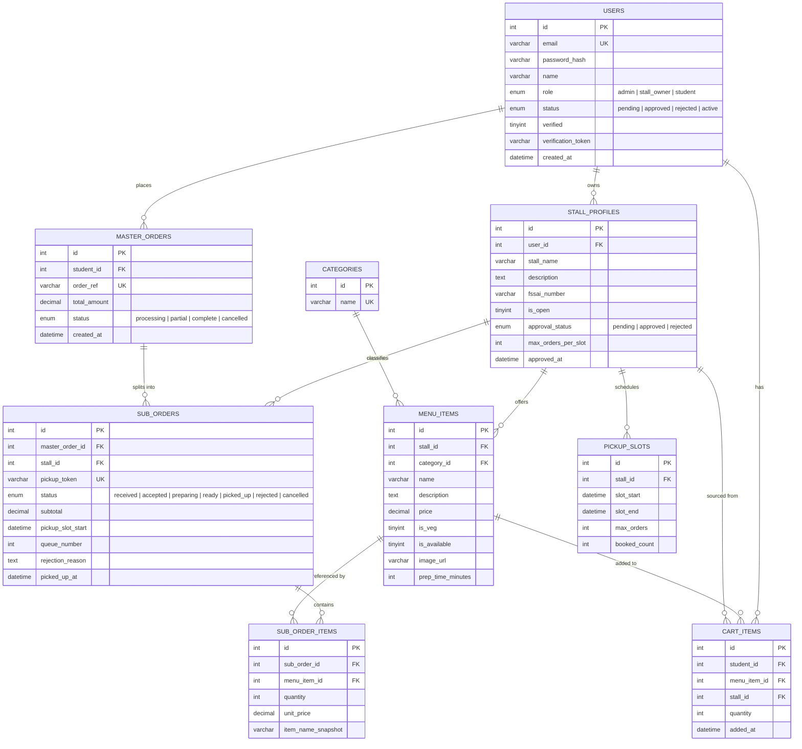
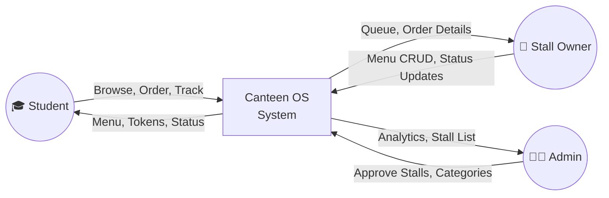
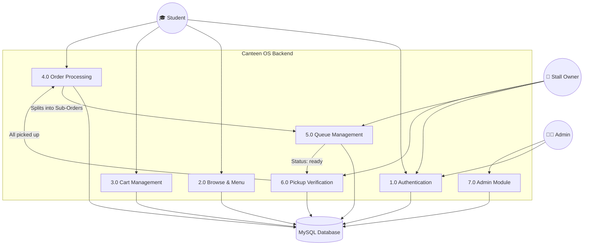
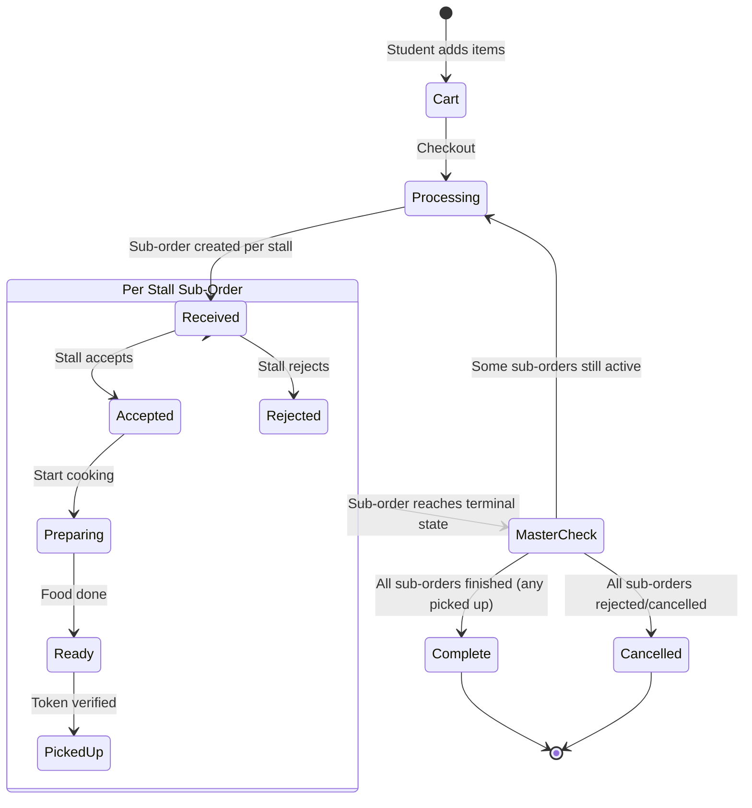
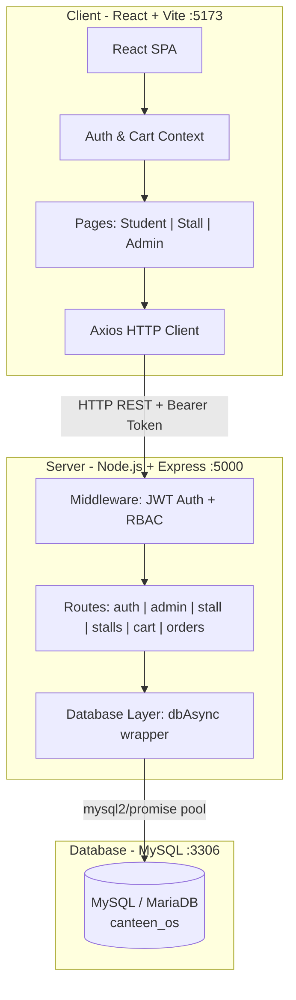
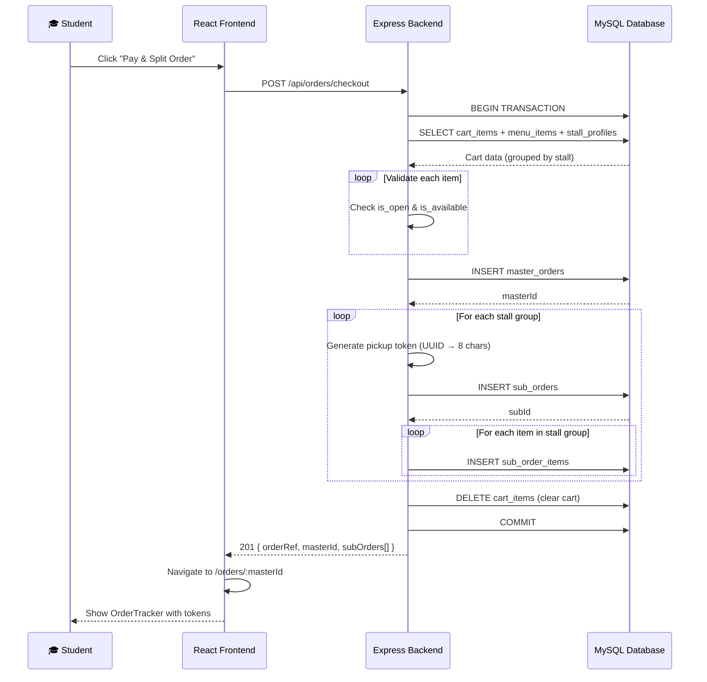
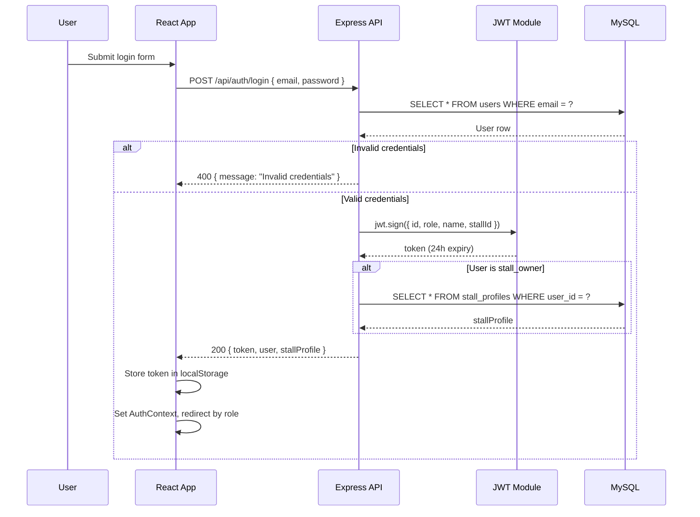
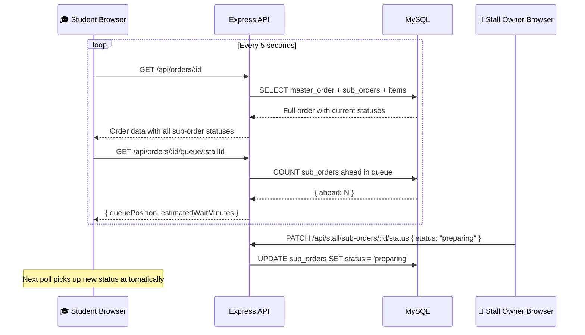
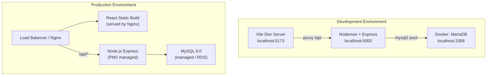

# Canteen OS — Mermaid Diagrams

This file contains all architectural and design diagrams for the Canteen OS project in Mermaid syntax.
Render them using any Mermaid-compatible viewer (VS Code extension, GitHub markdown, mermaid.live, etc.)

---

## 1. Entity-Relationship Diagram (ERD)

---

## 2. Use Case Diagram

```mermaid
graph TB
    subgraph "Canteen OS System"
        UC1["Browse Open Stalls"]
        UC2["View Stall Menu"]
        UC3["Add to Unified Cart"]
        UC4["Checkout & Pay"]
        UC5["Track Order Status"]
        UC6["View Pickup Token"]
        UC7["View Order History"]

        UC8["Manage Menu Items"]
        UC9["Toggle Stall Open/Close"]
        UC10["View Live Queue"]
        UC11["Accept / Reject Orders"]
        UC12["Update Order Status"]
        UC13["Verify Pickup Token"]
        UC14["View Stall History"]

        UC15["Approve / Reject Stalls"]
        UC16["Manage Food Categories"]
        UC17["View Platform Analytics"]
    end

    Student(("🎓 Student"))
    StallOwner(("🍳 Stall Owner"))
    Admin(("👨‍💼 Admin"))

    Student --> UC1
    Student --> UC2
    Student --> UC3
    Student --> UC4
    Student --> UC5
    Student --> UC6
    Student --> UC7

    StallOwner --> UC8
    StallOwner --> UC9
    StallOwner --> UC10
    StallOwner --> UC11
    StallOwner --> UC12
    StallOwner --> UC13
    StallOwner --> UC14

    Admin --> UC15
    Admin --> UC16
    Admin --> UC17
```

---

## 3. Data Flow Diagram (Level 0 — Context)

---

## 4. Data Flow Diagram (Level 1 — Detailed)

---

## 5. Order Lifecycle State Diagram

---

## 6. System Architecture Diagram

---

## 7. Checkout & Order Splitting Sequence Diagram

---

## 8. Authentication & Authorization Flow

---

## 9. Real-Time Queue Polling Diagram

---

## 10. Deployment Architecture

